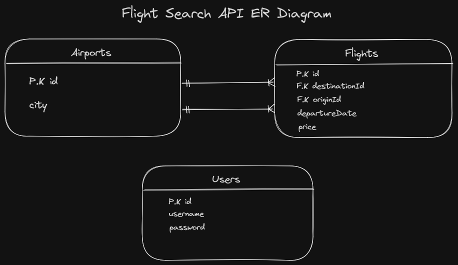

# Flight Search API

> ### Amadeus Case Study

This codebase was created to demonstrate a **Flight Search API** built with **Spring Boot**
including CRUD operations, authentication,
scheduled jobs, entity relations, pagination and more.

## Getting Started

>  * docker build . -t flight-search
>  * docker run -p 8080:8080 flight-search

## How it works

# 
